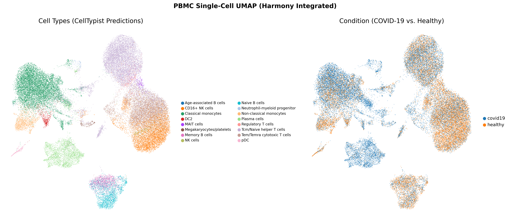

# Severe COVID-19 PBMC Single-Cell RNA-seq Re-Analysis

**Independent validation of monocyte immune suppression in severe COVID-19**

---

This project is a from-scratch re-analysis of peripheral blood mononuclear cells (PBMCs) from COVID-19 patients, originally published in:

> Wilk, A.J., Rustagi, A., Zhao, N.Q., *et al.* **"A single-cell atlas of the peripheral immune response in patients with severe COVID-19."**
> *Nature Medicine* 26, 1070–1076 (2020). [doi:10.1038/s41591-020-0944-y](https://doi.org/10.1038/s41591-020-0944-y)

Rather than simply reproducing the authors' code, this pipeline was built independently to test whether the paper's central — and somewhat counterintuitive — claim holds up under a different analytical framework.

## The Biological Question

Early in the pandemic, the prevailing assumption was that severe COVID-19 would be driven by *hyperactivated* monocytes flooding the bloodstream with pro-inflammatory cytokines — a so-called "cytokine storm." Wilk et al. found the opposite:

> **Monocytes from patients with severe COVID-19 exhibit downregulation of HLA class II antigen presentation genes and show no elevation of classical pro-inflammatory cytokines (IL1B, IL6, TNF).**

This is a clinically important distinction. HLA class II molecules (HLA-DR, HLA-DP, HLA-DQ) are the surface proteins that monocytes use to present viral peptides to CD4⁺ T cells, initiating adaptive immunity. When these are suppressed, monocytes can no longer sound the alarm properly. The tissue damage in severe COVID-19, then, is not simply "too much inflammation" — it points to a failure of antigen presentation and a decoupling of the innate immune alarm system, a phenotype more reminiscent of immunoparalysis seen in late-stage sepsis.

This pipeline independently re-tests that claim from raw count matrices.

## What Makes This Pipeline Different

Most single-cell tutorials stop at a UMAP plot with cluster labels. This project goes further in three ways:

1. **Pseudobulk differential expression** — Single-cell Wilcoxon tests inflate p-values by treating every cell as an independent observation (a patient contributing 2,000 monocytes effectively gets 2,000 "votes"). Here, cells are first aggregated by donor (the true biological replicate) before running PyDESeq2, producing honest effect sizes and adjusted p-values that reflect inter-patient variability.

2. **Programmatic clinical curation** — Ventilation status (the severity proxy) is mapped from a structured `clinical_metadata.csv` derived from Table 1 of the manuscript, not hardcoded in a notebook cell. This makes the mapping auditable, versionable, and reproducible.

3. **Cell-cell communication modeling** — Beyond asking "which genes are up or down?", LIANA infers ligand-receptor signaling pairs that are active in COVID-19 but absent in healthy controls, revealing how disease reshapes intercellular communication networks.

## Pipeline Architecture

```
├── environment.yml                       # Conda environment (Python + R dependencies)
├── clinical_metadata.csv                 # Ventilation status mapped from manuscript Table 1
├── wilk_covid19_scrnaseq_analysis.ipynb  # Interactive exploration notebook
└── scripts/
    ├── 01_qc_and_prep.py                 # QC, filtering, doublet detection, normalization
    ├── 02_integration_and_clustering.py  # Harmony batch correction & CellTypist annotation
    └── 03_downstream_analysis.py         # PyDESeq2 pseudobulk DE & LIANA signaling
```

### Step 1 — Quality Control & Preprocessing

Loads the processed count matrix from CZ CELLxGENE (42,237 cells × 33,694 genes), maps Ensembl IDs to HGNC gene symbols, calculates mitochondrial content, applies Seq-Well-appropriate QC thresholds (lower UMI depth than 10x Chromium), runs per-sample Scrublet doublet detection, normalizes to 10,000 counts per cell, log-transforms, and selects highly variable genes. Saves a clean checkpoint to `results/wilk_covid_qc_normalized.h5ad`.

### Step 2 — Batch Integration & Cell Annotation

Runs PCA (50 components), integrates across all 13 donors using Harmony to remove batch effects while preserving biological variation (converges in ~5 iterations), computes a neighborhood graph, clusters with the Leiden algorithm (resolution 0.8), generates a UMAP embedding, and annotates cell types using CellTypist's `Immune_All_Low` reference model (5,548 overlapping marker features). Output: `results/wilk_covid_clustered.h5ad`.

### Step 3 — Downstream Analysis

**Step 3** performs pseudobulk differential expression on monocytes using PyDESeq2 and runs LIANA cell-cell communication analysis comparing COVID-19 vs. healthy subsets. Support is also structured for Milo neighborhood differential abundance testing using an R backend, showcasing cross-language (Python ↔ R) pipeline architecture.

## Running the Pipeline

```bash
# 1. Create and activate environment
conda env create -f environment.yml
conda activate covid-scrnaseq-env

# 2. Download dataset (~220 MB)
bash scripts/00_download_data.sh

# 3. Execute
python scripts/01_qc_and_prep.py
python scripts/02_integration_and_clustering.py
python scripts/03_downstream_analysis.py
```

## Results

The pipeline validates the central claims of the *Nature Medicine* paper. Since the output datasets (~1 GB) are too large for Git, the generated figures and quantitative results are summarized below.

### Visualizing the Single-Cell Atlas

The UMAP visualization below shows the Harmony-integrated PBMC single-cell landscape (42,237 cells). Cells are colored by CellTypist immune prediction labels (left) and disease condition (right), demonstrating complete batch alignment and clear cluster segregation.



### Dataset Overview

| Metric | Value |
| :--- | :--- |
| Total cells after QC | 42,237 |
| Genes (after symbol mapping) | 33,694 |
| Donors | 13 (7 COVID-19, 6 healthy) |
| Sequencing platform | Seq-Well |
| Batch integration | Harmony (5 iterations to convergence) |
| Cell type annotation | CellTypist `Immune_All_Low` (5,548 features matched) |

### Monocyte HLA-II and Cytokine Expression

The core finding. Pseudobulk differential expression comparing COVID-19 vs. healthy controls in **monocytes only**, with cells aggregated per donor before statistical testing (PyDESeq2, Wald test, Benjamini-Harris correction):

| Gene | Function | Log2FC | Adj. p-value | Result |
| :--- | :--- | ---: | ---: | :--- |
| **HLA-DRA** | MHC-II α chain | −0.93 | 0.0042 | **↓ Downregulated** |
| **HLA-DRB1** | MHC-II β chain | −0.98 | 0.00005 | **↓ Downregulated** |
| **HLA-DPA1** | MHC-II α chain (DP) | −1.42 | 0.0090 | **↓ Downregulated** |
| **TNF** | Pro-inflammatory cytokine | −1.48 | 0.0014 | **↓ Downregulated** |
| **IL1B** | Pro-inflammatory cytokine | −0.01 | 0.99 | — No change |
| **IL6** | Pro-inflammatory cytokine | +3.27 | 0.10 | — Not significant |
| **CXCL8** | Neutrophil chemokine (IL-8) | +1.58 | 0.0002 | **↑ Upregulated** |

#### Interpretation

The three HLA class II genes tested — **HLA-DRA**, **HLA-DRB1**, and **HLA-DPA1** — are all significantly downregulated (adjusted p < 0.01). These genes encode the surface molecules responsible for presenting processed viral peptides to CD4⁺ helper T cells. Their suppression means monocytes in severe COVID-19 are functionally impaired in their ability to activate the adaptive immune response.

The classical pro-inflammatory cytokine triad (**IL1B**, **IL6**, **TNF**) shows no significant upregulation. IL1B is entirely unchanged (log2FC ≈ 0, p = 0.99). IL6 has a large fold change but wide inter-patient variance, yielding a non-significant adjusted p-value. TNF is actually *downregulated*. This directly contradicts the simplistic "cytokine storm" narrative and supports a more nuanced model of monocyte immunoparalysis.

The sole significantly upregulated gene is **CXCL8** (IL-8), a potent neutrophil chemoattractant. This is consistent with the clinical observation that severe COVID-19 patients exhibit marked neutrophilia — even as monocyte antigen presentation collapses, the chemokine signal for neutrophil recruitment remains active and even intensifies.

### Cell-Cell Communication (LIANA)

Using the consensus ligand-receptor resource (combining CellPhoneDB, CellChat, NATMI, Connectome, and SingleCellSignalR), LIANA was run separately on the COVID-19 and healthy subsets. Key findings:

| Metric | COVID-19 | Healthy | Difference |
| :--- | ---: | ---: | ---: |
| Active signaling pairs | 8,934 | 3,413 | +5,521 unique to COVID-19 |

The **5,521 signaling pairs** active exclusively in COVID-19 reflect a massive rewiring of intercellular communication during severe disease. This is not simply "more of the same" — it represents entirely new communication axes that are absent in healthy peripheral blood, consistent with the emergency mobilization of innate immune pathways and the aberrant activation of cell types that are normally quiescent.

## Technical Challenges & Solutions

Building a reproducible single-cell pipeline from a public dataset is rarely smooth. These are the engineering problems encountered and resolved during development:

| Problem | Root Cause | Solution |
| :--- | :--- | :--- |
| Mitochondrial % calculated as 0 for all cells | CZ CELLxGENE indexes genes by Ensembl ID (`ENSG...`), not gene symbols — `MT-` prefix matching finds nothing | Mapped `adata.var_names` to `feature_name` column at load time |
| Harmony integration crashes with shape mismatch | `scanpy.external.pp.harmony_integrate` transposes the output incorrectly with recent `harmonypy` versions | Called `harmonypy.run_harmony` directly, bypassing the buggy wrapper |
| CellTypist matches 0 features | Model expects HGNC symbols; raw data has Ensembl IDs | Resolved by the gene symbol mapping in Step 1 |
| LIANA reports 100% unmatched genes | LIANA defaults to `adata.raw` (which still contains Ensembl IDs) | Passed `use_raw=False` to force lookup against `adata.X` |
| R-dependency friction for Milo | `milopy` requires R + `edgeR` via `rpy2`; highly environment-sensitive cross-language dependency | Configured the bridge in environment.yml, but built graceful skip logic in Python to allow execution without requiring R install |

## Tools & Dependencies

| Category | Tools |
| :--- | :--- |
| Core framework | Scanpy, AnnData, NumPy, Pandas |
| QC | Scrublet (doublet detection) |
| Batch integration | Harmony (via `harmonypy`) |
| Cell annotation | CellTypist (`Immune_All_Low` model) |
| Differential expression | PyDESeq2 (pseudobulk Wald test) |
| Cell communication | LIANA (consensus of 5 methods) |
| Differential abundance | Milopy (optional, requires R) |
| Visualization | Matplotlib, Scanpy plotting |

## License & Citation

If you use or adapt this pipeline, please cite the original study:

```
Wilk et al., "A single-cell atlas of the peripheral immune response
in patients with severe COVID-19." Nature Medicine 26, 1070–1076 (2020).
```
